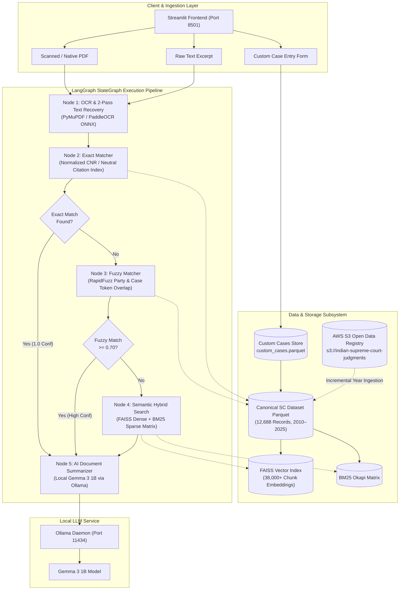
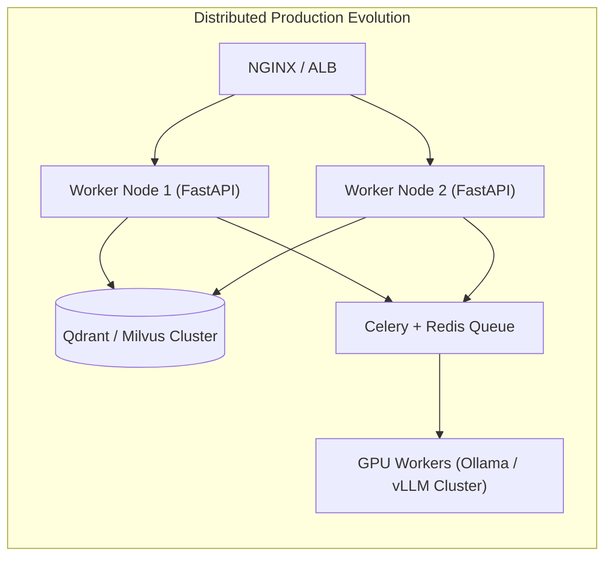

# 🏛️ System Architecture & Production Deployment Blueprint
## Indian Supreme Court Legal Case Matcher & Custom Case Engine

---

## 1. Executive System Overview

The **Legal Case Matcher & Custom Case Engine** is a high-throughput, fault-tolerant legal intelligence system designed to ingest, process, match, and analyze Indian Supreme Court judgments (1950–Present, spanning 12,680+ canonical decisions) along with real-time user-provided custom cases.

The system is built on a **LangGraph StateGraph** agentic architecture with a multi-layered fallback cascade:
1. **OCR Ingestion & 2-Pass Character Recovery Engine**: High-fidelity text extraction and OCR confusion repair (`O` $\leftrightarrow$ `0`, `I`/`l` $\leftrightarrow$ `1`, `S` $\leftrightarrow$ `5`, `B` $\leftrightarrow$ `8`).
2. **3-Tier Matching Cascade**: Exact Key Lookup $\rightarrow$ RapidFuzz Token Match $\rightarrow$ Dense FAISS + Sparse BM25 Hybrid Search.
3. **Dynamic Custom Case Indexer**: In-memory and on-disk Parquet indexing allowing live updates without service interruption.
4. **Local Neural Summarizer**: Offline structured 10-point legal summaries generated via Ollama (`gemma3:1b`).

---

## 2. High-Level Architecture Diagram



---

## 3. Core Component Architecture

### 3.1. OCR & 2-Pass Character Recovery Engine
- **Primary Extraction**: PyMuPDF (`fitz`) handles rapid direct-stream text extraction from digital PDFs.
- **Scanned PDF Processing**: RapidOCR / PaddleOCR (ONNX Runtime) extracts character coordinates, bounding boxes, and raw text layers.
- **2-Pass Scoped Character Repair**:
  - *Pass 1*: Strict regex extraction of CNR (`(?:ESCR|[A-Z]{4,7})\d{10,12}`) and Neutral Citation (`\d{4} INSC \d+`).
  - *Pass 2*: Scoped character disambiguation applied strictly to candidate alphanumeric tokens if Pass 1 yields no valid identifier:
    $$\text{Confusions: } \{O, o\} \rightarrow 0,\; \{I, l\} \rightarrow 1,\; \{S, s\} \rightarrow 5,\; \{B\} \rightarrow 8$$

### 3.2. LangGraph StateGraph Workflow
The orchestration engine models execution as a deterministic finite state machine (`MatchingState`):

```python
class MatchingState(TypedDict):
    raw_input: Any
    filename: str
    is_ocr: bool
    extracted_text: str
    ocr_corrected: bool
    fields: Dict[str, Any]
    query_rec: Dict[str, Any]
    matched_record: Optional[Dict[str, Any]]
    match_tier: str       # "exact" | "fuzzy" | "semantic" | "none"
    confidence: float     # 0.0 to 1.0
    matched_on: str
    summary: str
    execution_trace: List[str]
    error: Optional[str]
```
- **Conditional Routing**: Short-circuits the pipeline to the summarization stage immediately upon finding high-confidence matches, conserving compute resources.

### 3.3. 3-Tier Match Cascade
1. **Tier 1 (Exact Match)**:
   - Primary Key: Normalized alphanumeric CNR comparison.
   - Secondary Key: `(Case Number + Court Name + Year)` composite lookup against hash maps.
   - Latency: $< 1\text{ ms}$.
2. **Tier 2 (Fuzzy Token Match)**:
   - Pre-filters candidates via token intersection after removing legal stopwords (`STATE`, `UNION`, `INDIA`, `ORS`, `PETITIONER`, `RESPONDENT`, etc.).
   - Employs RapidFuzz token sort and ratio matching with a confidence threshold $\ge 0.70$.
   - Latency: $5\text{--}15\text{ ms}$.
3. **Tier 3 (Hybrid Semantic Match)**:
   - **Dense Embeddings**: `sentence-transformers/all-MiniLM-L6-v2` generates 384-dimensional dense vectors across case opening, holding, and body text.
   - **Sparse Scoring**: BM25 Okapi calculates term-frequency sparse relevance.
   - **Ensemble Function**:
     $$S_{\text{hybrid}} = \alpha \cdot S_{\text{dense}} + (1 - \alpha) \cdot S_{\text{sparse}} \quad (\alpha = 0.65)$$
   - Minimum activation threshold: $0.75$.
   - Latency: $15\text{--}30\text{ ms}$.

### 3.4. Dynamic In-Memory & Persistent Custom Case Engine
- Maintains a runtime registry (`CustomCaseManager`) that persists user-created cases into `custom_cases.parquet`.
- Re-indexes the in-memory FAISS vector index and BM25 sparse structures in real-time.
- Supports batch export and import of `.json` bundles for seamless sharing across environments.

---

## 4. Comprehensive Tech Stack

| Layer / Component | Technology | Version | Purpose & Function |
| :--- | :--- | :--- | :--- |
| **Agentic Workflow** | `langgraph` | `>= 1.2.0` | StateGraph execution, node transitions & conditional routing |
| **LLM Core Framework** | `langchain-core` | `>= 1.6.0` | Schema standardizations & agent interfaces |
| **Frontend UI** | `streamlit` | `>= 1.30.0` | High-responsiveness web UI & dashboard |
| **OCR (ONNX)** | `rapidocr-onnxruntime` / `paddleocr` | `>= 2.7.0` | High-accuracy offline optical character recognition |
| **PDF Processing** | `PyMuPDF` (`fitz`) | `>= 1.23.0` | Direct stream memory extraction & rasterization |
| **Dense Vector Search** | `faiss-cpu` | `>= 1.7.4` | Inverted index & inner product dense vector search |
| **Embeddings Model** | `sentence-transformers` | `>= 2.2.2` | `all-MiniLM-L6-v2` 384-d dense embedding generation |
| **Fuzzy Matching** | `rapidfuzz` | `>= 3.0.0` | C++ accelerated Levenshtein & token ratio matcher |
| **Data Engine** | `pandas`, `pyarrow` | `>= 2.0.0` | Columnar Parquet read/write & deduplication engine |
| **LLM Inference** | `Ollama` (`gemma3:1b`) | `Latest` | Local offline 10-section structured legal summarization |
| **HTTP Engine** | `httpx` | `>= 0.25.0` | Asynchronous communication with Ollama daemon |

---

## 5. Storage & Data Architecture

```text
legal_case_app/
├── app.py                          # Streamlit Production Frontend
├── engine.py                       # Consolidated Backend Engine & LangGraph StateGraph
├── requirements.txt                # Production dependency specification
└── data/
    └── custom_cases.parquet        # Persistent store for user-created custom cases

okf-benchmark/engine_source/
├── config.yaml                     # Engine thresholds & hyperparameter configuration
├── reports/
│   ├── canonical_cases_2021_2026.parquet  # Master dataset (12,688 SC judgments)
│   └── 150_doc_benchmark_report.md       # Empirical benchmark evaluation report
└── src/
    ├── ingest/incremental_year_ingest.py # Multi-year S3 streaming ingester
    └── match/                            # Cascade search modules (Exact, Fuzzy, Semantic)
```

### Data Schema (`canonical_cases.parquet`)
```sql
CREATE TABLE canonical_cases (
    cnr VARCHAR(16) PRIMARY KEY,
    case_number VARCHAR(64),
    case_id VARCHAR(64),
    nc_display VARCHAR(64),
    court_name VARCHAR(128),
    bench VARCHAR(256),
    year INTEGER,
    petitioner TEXT,
    respondent TEXT,
    parties TEXT,
    judge TEXT,
    decision_date VARCHAR(32),
    disposal_nature VARCHAR(64),
    extracted_text_snippet TEXT,
    chunk_opening TEXT,
    chunk_holding TEXT,
    chunk_body TEXT,
    is_custom BOOLEAN DEFAULT FALSE
);
```

---

## 6. Production Deployment Blueprint

### 6.1. System Requirements & Hardware Sizing

| Metric | Minimum (Evaluation) | Recommended (Production) |
| :--- | :--- | :--- |
| **CPU** | 4 Cores (x86_64 or ARM64) | 8–16 Cores |
| **RAM** | 8 GB | 16–32 GB |
| **Storage** | 10 GB SSD | 50 GB NVMe SSD |
| **GPU** | Not required (CPU optimized) | Optional (NVIDIA T4 / A10G for accelerated OCR / Ollama) |
| **OS** | Ubuntu 22.04 LTS / macOS 13+ | Ubuntu 22.04 / 24.04 LTS |

---

### 6.2. Bare-Metal / Virtual Machine Deployment

#### Step 1: Clone Repository & Prepare Environment
```bash
git clone https://github.com/yashvvrn/legal-case-matcher-sc.git /opt/legal-case-matcher
cd /opt/legal-case-matcher

# Create virtual environment
python3 -m venv backend/venv
source backend/venv/bin/activate

# Install dependencies
pip install --upgrade pip
pip install -r legal_case_app/requirements.txt
```

#### Step 2: Setup Local LLM Daemon (Ollama)
```bash
# Install Ollama
curl -fsSL https://ollama.com/install.sh | sh

# Start Ollama service and pull model
systemctl enable --now ollama
ollama pull gemma3:1b
```

#### Step 3: Configure Systemd Services

**1. Streamlit Application Service (`/etc/systemd/system/legal-case-app.service`)**:
```ini
[Unit]
Description=Legal Case Matcher & Custom Case Engine
After=network.target ollama.service

[Service]
Type=simple
User=www-data
WorkingDirectory=/opt/legal-case-matcher
ExecStart=/opt/legal-case-matcher/backend/venv/bin/streamlit run legal_case_app/app.py \
    --server.port 8501 \
    --server.address 0.0.0.0 \
    --server.headless true \
    --browser.serverAddress 0.0.0.0 \
    --server.enableCORS false \
    --server.enableXsrfProtection true
Restart=always
RestartSec=5
Environment=PYTHONPATH=/opt/legal-case-matcher:/opt/legal-case-matcher/backend:/opt/legal-case-matcher/okf-benchmark/engine_source

[Install]
WantedBy=multi-user.target
```

**2. Enable and Start Application Service**:
```bash
sudo systemctl daemon-reload
sudo systemctl enable --now legal-case-app.service
sudo systemctl status legal-case-app.service
```

---

### 6.3. Containerized Deployment (Docker & Docker Compose)

#### `Dockerfile`
```dockerfile
FROM python:3.11-slim

ENV DEBIAN_FRONTEND=noninteractive \
    PYTHONUNBUFFERED=1 \
    PYTHONDONTWRITEBYTECODE=1 \
    PYTHONPATH="/app:/app/backend:/app/okf-benchmark/engine_source"

RUN apt-get update && apt-get install -y --no-install-recommends \
    build-essential \
    curl \
    libgl1 \
    libglib2.0-0 \
    libgomp1 \
    && rm -rf /var/lib/apt/lists/*

WORKDIR /app

COPY legal_case_app/requirements.txt .
RUN pip install --no-cache-dir -r requirements.txt

COPY . .

EXPOSE 8501

HEALTHCHECK --interval=30s --timeout=10s --start-period=30s --retries=3 \
  CMD curl -f http://localhost:8501/_stcore/health || exit 1

CMD ["streamlit", "run", "legal_case_app/app.py", "--server.port=8501", "--server.address=0.0.0.0"]
```

#### `docker-compose.yml`
```yaml
version: '3.8'

services:
  ollama:
    image: ollama/ollama:latest
    container_name: legal_ollama
    restart: unless-stopped
    ports:
      - "11434:11434"
    volumes:
      - ollama_data:/root/.ollama

  legal_app:
    build:
      context: .
      dockerfile: Dockerfile
    container_name: legal_case_matcher
    restart: unless-stopped
    ports:
      - "8501:8501"
    environment:
      - OLLAMA_HOST=http://ollama:11434
    volumes:
      - ./legal_case_app/data:/app/legal_case_app/data
      - ./okf-benchmark/engine_source/reports:/app/okf-benchmark/engine_source/reports
    depends_on:
      - ollama

volumes:
  ollama_data:
```

---

### 6.4. NGINX Reverse Proxy & SSL Termination

```nginx
server {
    listen 80;
    server_name legal-matcher.yourdomain.com;
    return 301 https://$host$request_uri;
}

server {
    listen 443 ssl http2;
    server_name legal-matcher.yourdomain.com;

    ssl_certificate /etc/letsencrypt/live/legal-matcher.yourdomain.com/fullchain.pem;
    ssl_certificate_key /etc/letsencrypt/live/legal-matcher.yourdomain.com/privkey.pem;

    client_max_body_size 50M;

    location / {
        proxy_pass http://127.0.0.1:8501;
        proxy_http_version 1.1;
        proxy_set_header Upgrade $http_upgrade;
        proxy_set_header Connection "upgrade";
        proxy_set_header Host $host;
        proxy_set_header X-Real-IP $remote_addr;
        proxy_set_header X-Forwarded-For $proxy_add_x_forwarded_for;
        proxy_set_header X-Forwarded-Proto $scheme;
        proxy_read_timeout 86400;
    }
}
```

---

## 7. Security, Privacy & Air-Gapped Operation

1. **Zero External API Dependency**: Embeddings (`all-MiniLM-L6-v2`), OCR (`RapidOCR ONNX`), and LLM generation (`Gemma 3 1B via Ollama`) run 100% locally on-premises.
2. **Air-Gapped Compliant**: No uploaded document or proprietary legal query leaves the local instance or private network.
3. **Data Sanitization**: OCR output is cleaned of illegal unicode characters, null bytes, and non-printable control sequences prior to state insertion.
4. **Parquet Integrity**: Atomically writes custom case records to prevent corruption under concurrent transactions.

---

## 8. Scalability & Horizontal Expansion Roadmap



1. **Vector Layer Transition**: Upgrade local FAISS CPU index to **Qdrant** or **Milvus** cluster for scaling beyond $10^7$ document chunks.
2. **REST API Interface**: Decouple `engine.py` into a high-concurrency FastAPI service with worker pooling (`uvicorn -w 4`).
3. **Distributed Async Queue**: Delegate heavy scanned PDF OCR tasks to Celery/Redis background workers.
