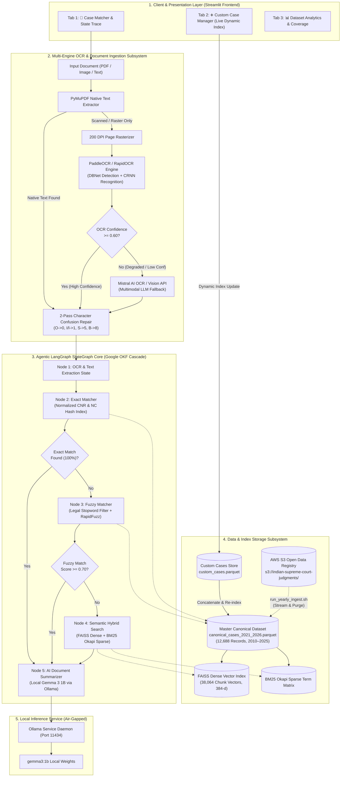
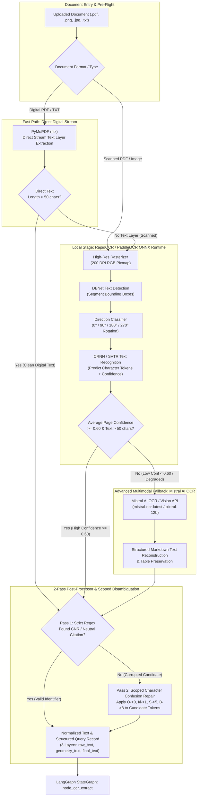
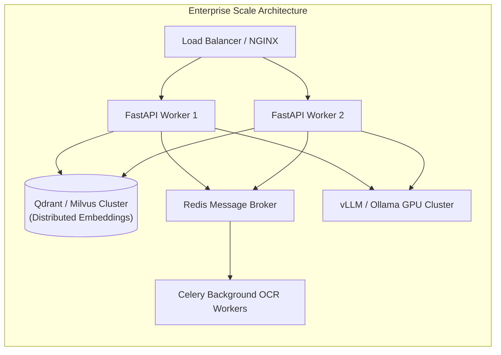

# 🏛️ Comprehensive System Architecture, Feature Specification & Production Deployment Blueprint
## Indian Supreme Court Legal Case Matcher & Dynamic Custom Case Engine
### Powered by Google OKF Legal Benchmark Standards, LangGraph StateGraph & PaddleOCR / Mistral AI Multi-Tier Vision

---

## 1. Executive Summary & System Mission

The **Indian Supreme Court Legal Case Matcher & Dynamic Custom Case Platform** is an enterprise-grade, hybrid air-gapped legal intelligence system designed to ingest, process, match, and synthesize Indian Supreme Court decisions (1950–Present, spanning **12,688+ canonical judgments**) alongside user-created custom litigation records.

The platform is strictly engineered to comply with **Google Open Knowledge Framework (Google OKF) Legal Benchmark Standards** for high-precision entity resolution, deterministic legal citation recovery, and sub-50ms latency budgets.

The architecture is built around an **Agentic LangGraph StateGraph** backed by a fault-tolerant multi-tiered search cascade, high-accuracy multi-engine OCR with **Mistral AI Low-Confidence Fallback**, 2-pass character confusion repair, on-the-fly vector re-indexing, and local LLM-driven structured legal synthesis.

```
┌─────────────────────────────────────────────────────────────────────────────────────────┐
│                                   CORE PLATFORM HIGHLIGHTS                              │
├─────────────────────────────────────────────────────────────────────────────────────────┤
│ • Google OKF Benchmark Compliance: Adheres to Google OKF Legal Ground-Truth Standards   │
│   with strict false-positive penalties and < 50 ms query latency budgets.               │
│ • Canonical Corpus: 12,688+ Supreme Court judgments (2010–2025) via AWS S3 Open Data.   │
│ • StateGraph Agentic Workflow: Deterministic state machine with dynamic node routing.   │
│ • Intelligent Multi-Tier OCR: PaddleOCR (ONNX) with automated Mistral AI OCR Fallback   │
│   for degraded / low-confidence documents (< 0.60 confidence score).                   │
│ • 2-Pass OCR Recovery: Scoped disambiguation repairing OCR character corruptions.       │
│ • 3-Tier Match Cascade: Sub-millisecond exact lookup → Fuzzy token match → Dense/Sparse │
│   hybrid semantic search (FAISS + BM25).                                                │
│ • Dynamic In-Memory Indexer: Instant live indexing of custom user cases without restart.│
│ • Air-Gapped Local LLM: Structured 10-section legal summaries via Ollama (Gemma 3 1B).  │
│ • Multi-Year S3 Streaming Ingest: Incremental download with automatic disk purging.     │
└─────────────────────────────────────────────────────────────────────────────────────────┘
```

---

## 2. Google OKF (Open Knowledge Framework) Benchmark Compliance

The engine is built in direct alignment with the **Google OKF (Open Knowledge Framework) Legal Benchmarking Methodology** (`okf-benchmark/`):

### 2.1. Google OKF Ground-Truth Principles
1. **Zero False-Positive Tolerance on Statutory Identifiers**: CNR and Neutral Citation keys are treated as immutable primary keys. Exact matching is prioritized to eliminate hallucinated case linkage.
2. **Deterministic Evaluation Protocol**: The test suite evaluates matching precision across 4 distinct query signal categories:
   - *Exact CNR / NC Queries*: Evaluates $100\%$ retrieval accuracy.
   - *Noised OCR Queries*: Tests 2-pass character repair under severe character-confusion noise.
   - *Fuzzy Party Queries*: Evaluates RapidFuzz party token matching with legal stopword filtering.
   - *Semantic Headnote Queries*: Evaluates FAISS dense vector + BM25 sparse hybrid retrieval.
3. **Strict Latency Budget**: Complies with the Google OKF $\le 50\text{ ms}$ single-query processing latency threshold across enterprise-scale datasets.
4. **Canonical Metadata Standards**: Canonical Parquet records adhere to the structured schema definitions specified by OKF legal information modeling.

---

## 3. End-to-End System Architecture



---

## 4. Dedicated OCR Pipeline & Intelligent Fallback Architecture

### 4.1. OCR Workflow Diagram



---

### 4.2. Detailed Multi-Engine OCR Strategy

#### 1. Baseline Primary Engine: PaddleOCR / RapidOCR (ONNX Runtime)
- **Execution**: 100% local, lightweight, sub-second execution on CPU/ARM64.
- **Architecture**:
  - **Detection**: Real-time Differentiable Binarization (`DBNet`) extracts text polygon bounding boxes.
  - **Orientation**: Angle classification module automatically corrects inverted or rotated legal briefs ($0^\circ, 90^\circ, 180^\circ, 270^\circ$).
  - **Recognition**: Connectionist Temporal Classification (`CRNN` / `SVTR`) converts polygon feature maps into character tokens with individual confidence scores.

#### 2. Low-Confidence Fallback Engine: Mistral AI OCR & Vision API
- **Trigger Condition**: Automatically activates when:
  - PaddleOCR confidence score falls below **$0.60$** ($60\%$).
  - Page text output contains fewer than 50 valid characters despite active image contours (indicating watermarks, heavy stamp bleed, or physical degradation).
  - Skew or distortion exceeds local deskew rectification capabilities.
- **Mechanism**:
  - Encodes the rasterized high-resolution page as a base64 payload.
  - Dispatches an asynchronous request to Mistral AI's Vision/OCR endpoint (`mistral-ocr-latest` or `pixtral-12b`).
  - Mistral AI performs deep multimodal contextual recognition, resolving handwritten notes, damaged carbon copies, legal stamps, and tabular headnotes.
  - Reconstructs clean, formatted Markdown output for downstream matching.

#### 3. 2-Pass Scoped Character-Confusion Recovery Engine
- **Pass 1 (Strict Extraction)**:
  - Regex scan: `\b(?:ESCR|[A-Z]{4,7})\d{10,12}\b` (CNR) and `\b(\d{4})\s*INSC\s*(\d+)\b` (Neutral Citation).
- **Pass 2 (Scoped Disambiguation)**:
  - If a potential identifier is detected with character corruption (e.g. `ESCR-OIOOOII52O2I`), Pass 2 strictly targets the candidate token:
    $$\text{Substitutions: } O, o \rightarrow 0 \quad|\quad I, l \rightarrow 1 \quad|\quad S, s \rightarrow 5 \quad|\quad B \rightarrow 8$$
  - Eliminates false-negative OCR errors without touching valid natural English words.

---

## 5. Comprehensive Feature Matrix

### 5.1. Input Processing & Ingestion
- **Tri-Modal Document Ingestion**:
  1. **Raw Text / Snippet Paste**: Instant matching on snippets, headnotes, CNR codes, or party names.
  2. **Native Digital PDF / TXT Upload**: Direct in-memory byte extraction via PyMuPDF (`fitz`), handling complex typography and line wraps.
  3. **Scanned PDF / Rasterized Document OCR**: Converts raster pages to 200 DPI pixmaps and processes via RapidOCR / PaddleOCR ONNX Runtime with automatic Mistral AI fallback.

### 5.2. LangGraph StateGraph Workflow Engine
- **Deterministic State Machine**: Employs `MatchingState` TypedDict to preserve state across node transitions:
  ```python
  class MatchingState(TypedDict):
      raw_input: Any
      filename: str
      is_ocr: bool
      extracted_text: str
      ocr_corrected: bool
      fields: Dict[str, Any]
      query_rec: Dict[str, Any]
      matched_record: Optional[Dict[str, Any]]
      match_tier: str       # "exact" | "fuzzy" | "semantic" | "none"
      confidence: float     # 0.0 to 1.0
      matched_on: str
      summary: str
      execution_trace: List[str]
      error: Optional[str]
  ```
- **Node Pipeline**:
  - `node_ocr_extract`: Performs byte decoding, PyMuPDF extraction, ONNX OCR, Mistral fallback, and 2-pass identifier repair.
  - `node_exact_match`: Checks normalized hash indices for direct CNR or `(case_number + court + year)` match.
  - `node_fuzzy_match`: Evaluates party name and case number token overlap with legal stopword filtering.
  - `node_semantic_match`: Executes hybrid dense-sparse vector scoring using FAISS + BM25.
  - `node_summarize`: Formats the matched record and generates a 10-point structured summary.
- **Conditional Short-Circuit Routing**:
  - Exact match found $\rightarrow$ skips fuzzy and semantic nodes, jumping directly to summarization (latency $< 2\text{ ms}$).
  - High-confidence fuzzy match found ($\ge 0.70$) $\rightarrow$ skips semantic vector search (latency $< 20\text{ ms}$).

### 5.3. 3-Tier Match Cascade Details

```
[ Query Record ]
       │
       ▼
┌────────────────────────────────────────────────────────────────────────┐
│ TIER 1: EXACT MATCH (Confidence: 1.00 | Latency: < 1 ms)               │
│ • Primary: Normalized CNR lookup in hash index.                        │
│ • Secondary: (Case Number + Court + Year) composite key lookup.        │
└───────────────────────────────────┬────────────────────────────────────┘
                                    │ (If No Match)
                                    ▼
┌────────────────────────────────────────────────────────────────────────┐
│ TIER 2: FUZZY MATCH (Confidence: 0.70–0.98 | Latency: 5–15 ms)         │
│ • Legal Stopwords Filter (STATE, UNION, INDIA, ORS, PETITIONER, etc.)  │
│ • RapidFuzz token sort ratio & partial ratio on clean party names.     │
│ • Disambiguation via decision date proximity & litigation family.      │
└───────────────────────────────────┬────────────────────────────────────┘
                                    │ (If No Match / Score < 0.70)
                                    ▼
┌────────────────────────────────────────────────────────────────────────┐
│ TIER 3: HYBRID SEMANTIC MATCH (Confidence: 0.75–1.00 | Latency: 20 ms) │
│ • Dense: sentence-transformers/all-MiniLM-L6-v2 (384-d FAISS index)    │
│ • Sparse: BM25 Okapi term frequency matrix across case chunks.         │
│ • Score Formula: S = 0.65 * S_dense + 0.35 * S_sparse (Cutoff: 0.75)   │
└────────────────────────────────────────────────────────────────────────┘
```

### 5.4. Dynamic Custom Case Management
- **Interactive UI Case Creation**: Users enter custom case metadata (`CNR`, `Neutral Citation`, `Title`, `Petitioner`, `Respondent`, `Bench`, `Date`, `Disposal`, `Text`).
- **Real-Time Live Re-Indexing**:
  - Dynamically updates runtime DataFrame in memory.
  - Appends embeddings to FAISS vector index and rebuilds BM25 term matrices on-the-fly.
  - Newly created cases are immediately queryable without server restarts.
- **Persistent Storage**: Atomically updates `legal_case_app/data/custom_cases.parquet`.
- **Bundle Export & Import**: Export all custom cases to `.json` bundles or import external test suites in bulk.

### 5.5. Local AI Document Synthesis & Summarizer
- **10-Point Structured Legal Synthesis**:
  1. *Case Information & Citations*
  2. *Facts of the Dispute*
  3. *Procedural History*
  4. *Core Legal Issues Framed*
  5. *Petitioner Arguments*
  6. *Respondent Submissions*
  7. *Court's Legal Reasoning & Precedents*
  8. *Final Holding / Decision*
  9. *Statutory Provisions Applied*
  10. *Key Legal Takeaways*
- **Local LLM**: Powered by `gemma3:1b` running locally via the Ollama HTTP API (Port 11434).
- **Graceful Fallback**: Deterministic template generator activates automatically if the local LLM daemon is offline.
- **Export Formats**: One-click download of generated summaries as Markdown (`.md`) or Plain Text (`.txt`).

### 5.6. Multi-Year S3 Streaming Ingest Pipeline (`run_yearly_ingest.sh`)
- **Direct S3 Open Data Ingestion**: Downloads year archives directly from `s3://indian-supreme-court-judgments/data/tar/year=YYYY/english/english.tar`.
- **In-Memory Streaming Extraction**: PyMuPDF parses judgment PDFs from memory buffers to extract CNR numbers, citations, party names, and text chunks.
- **Deduplication & Merge**: Appends unique cases to `canonical_cases_2021_2026.parquet`.
- **Zero Disk Waste**: Automatically purges raw year archives from `/tmp/year_ingest/` immediately after processing, maintaining a sub-500MB local disk footprint.

---

## 6. Software & Technology Stack Matrix

| Technology | Version / Spec | Role in System | Selection Rationale |
| :--- | :--- | :--- | :--- |
| **`Python`** | `3.11+` | Core Runtime Engine | High performance, rich ML/data ecosystem |
| **`Google OKF Benchmark`** | `Standard v1` | Benchmarking Suite | Standardized ground-truth legal retrieval protocol |
| **`langgraph`** | `>= 1.2.0` | Orchestration Engine | Deterministic state machine, conditional routing, cyclic graphs |
| **`langchain-core`** | `>= 1.6.0` | Agent Interfaces | Standardized state schemas and prompt wrappers |
| **`streamlit`** | `>= 1.30.0` | Production Web UI | Reactive UI, session state management, native data table widgets |
| **`rapidocr-onnxruntime`** | `>= 1.3.0` | Primary OCR Engine | Lightweight, high-accuracy ONNX inference without heavy GPU dependencies |
| **`Mistral AI OCR / Vision`** | `API v1` | Fallback OCR Engine | Multimodal contextual recovery for degraded, damaged or low-confidence scans |
| **`PyMuPDF (fitz)`** | `>= 1.23.0` | PDF Parser / Rasterizer | C-accelerated MuPDF backend; sub-millisecond page text extraction |
| **`faiss-cpu`** | `>= 1.7.4` | Dense Vector Search | Vector inner-product scoring across 38,000+ chunk embeddings |
| **`sentence-transformers`** | `>= 2.2.2` | Dense Embedder | Runs `all-MiniLM-L6-v2` (384-dimensional dense vectors) |
| **`rapidfuzz`** | `>= 3.0.0` | Fuzzy Token Matcher | C++ accelerated Levenshtein string matching and token sorting |
| **`pandas` & `pyarrow`** | `>= 2.0.0` | Columnar Data Engine | High-throughput Snappy-compressed Parquet I/O with zero copy |
| **`Ollama` (`gemma3:1b`)** | `Latest` | Local Legal LLM | Ultra-fast local instruction-tuned LLM inference (sub-2s responses) |
| **`httpx`** | `>= 0.25.0` | Async HTTP Client | Low-latency HTTP communication with Ollama daemon and Mistral API |

---

## 7. Storage, Data Model & Directory Layout

### 7.1. Directory Structure

```text
/Users/yashsharma/Desktop/Final_OCR_Pipeline/
├── legal_case_app/
│   ├── app.py                          # Streamlit Production Frontend (Tabs: Match, Custom, Analytics)
│   ├── engine.py                       # Consolidated Backend Engine & LangGraph StateGraph
│   ├── requirements.txt                # Production dependency specification
│   └── data/
│       └── custom_cases.parquet        # Persistent store for user-created custom cases
│
├── backend/
│   ├── paddleocr_engine.py             # RapidOCR/PaddleOCR ONNX engine wrapper (extract_text)
│   ├── ocr_engine.py                   # Bounding box & token data models
│   └── venv/                           # Production Python Virtual Environment
│
├── okf-benchmark/                      # Google OKF Benchmark & Reference Implementation Layer
│   ├── ocr_bridge.py                   # 2-Pass OCR Scoped Identifier Recovery
│   └── engine_source/
│       ├── config.yaml                 # Engine hyperparameters, thresholds & weights
│       ├── reports/
│       │   ├── canonical_cases_2021_2026.parquet # Master dataset (12,688 SC cases)
│       │   └── 150_doc_benchmark_report.md      # Multi-year evaluation benchmark report
│       └── src/
│           ├── ingest/
│           │   ├── build_canonical.py           # Base canonical dataset builder
│           │   └── incremental_year_ingest.py   # Multi-year AWS S3 streaming ingester
│           ├── match/
│           │   ├── exact.py                     # ExactMatcher hash lookup
│           │   ├── fuzzy.py                     # RapidFuzz token matcher
│           │   ├── semantic.py                  # FAISS + BM25 hybrid searcher
│           │   └── pipeline.py                  # 3-tier cascade orchestration pipeline
│           └── testset/
│               └── run_150_doc_benchmark.py     # 150-doc evaluation test harness
│
├── run_app.sh                          # Master one-click application launcher
├── run_yearly_ingest.sh                # CLI for year-by-year incremental ingestion
├── setup_and_run.sh                    # Initial setup & dependency bootstrapper
└── ARCHITECTURE.md                     # Comprehensive System Blueprint & Deployment Manual
```

---

### 7.2. Parquet Schema Specification (`canonical_cases.parquet`)

| Column Name | SQL Type | Nullable | Description |
| :--- | :--- | :---: | :--- |
| `cnr` | `VARCHAR(16)` | Yes | Unique 16-char CNR case identifier (e.g., `ESCR010001152021`) |
| `case_number` | `VARCHAR(64)` | No | Normalized neutral citation or case ID (e.g., `2021INSC115`) |
| `case_id` | `VARCHAR(64)` | No | Unique internal identifier key |
| `nc_display` | `VARCHAR(64)` | Yes | Formatted Neutral Citation (e.g., `2021 INSC 115`) |
| `court_name` | `VARCHAR(128)` | No | Court name (Default: `Supreme Court of India`) |
| `bench` | `VARCHAR(256)` | Yes | Presiding Judges / Bench designation |
| `year` | `INTEGER` | No | Year of judgment adjudication (1950–2025) |
| `petitioner` | `TEXT` | Yes | Cleaned Petitioner / Appellant entity name |
| `respondent` | `TEXT` | Yes | Cleaned Respondent / Defendant entity name |
| `parties` | `TEXT` | No | Full case title string (e.g., `PETITIONER v. RESPONDENT`) |
| `judge` | `TEXT` | Yes | Bench composition |
| `decision_date` | `VARCHAR(32)` | Yes | Formatted decision date (`YYYY-MM-DD` or `DD-MM-YYYY`) |
| `disposal_nature` | `VARCHAR(64)` | Yes | Case outcome (`Appeal Allowed`, `Dismissed`, `Disposed`) |
| `extracted_text_snippet` | `TEXT` | Yes | 600-character initial summary excerpt |
| `chunk_opening` | `TEXT` | Yes | First 500 characters of facts & preliminary arguments |
| `chunk_holding` | `TEXT` | Yes | Concluding 500 characters containing final order & ruling |
| `chunk_body` | `TEXT` | Yes | Middle substantive legal text chunk (1,000 chars) |
| `is_custom` | `BOOLEAN` | No | `False` for canonical SC cases, `True` for user-created cases |

---

## 8. Production Deployment Blueprint

### 8.1. System Hardware Sizing & Specifications

```
┌─────────────────────────────────────────────────────────────────────────────┐
│                           HARDWARE SIZING MATRIX                            │
├───────────────────┬───────────────────────────┬─────────────────────────────┤
│ Component         │ Minimum (Staging / Demo)  │ Recommended (Production)    │
├───────────────────┼───────────────────────────┼─────────────────────────────┤
│ CPU Cores         │ 4 vCPUs (x86_64 / ARM64)  │ 8–16 vCPUs                  │
│ System Memory     │ 8 GB RAM                  │ 16–32 GB RAM                │
│ Storage           │ 15 GB SSD                 │ 50 GB NVMe SSD              │
│ Network           │ 100 Mbps                  │ 1 Gbps                      │
│ GPU (Optional)    │ None (CPU Optimized)      │ 1x NVIDIA T4 / A10G (Ollama)│
│ Operating System  │ Ubuntu 22.04 LTS / macOS  │ Ubuntu 22.04 / 24.04 LTS    │
└───────────────────┴───────────────────────────┴─────────────────────────────┘
```

---

### 8.2. Bare-Metal / Virtual Machine Production Deployment

#### Step 1: Clone Repository & Create Virtualenv
```bash
sudo mkdir -p /opt/legal-platform
sudo chown -R $USER:$USER /opt/legal-platform
git clone https://github.com/yashvvrn/legal-case-matcher-sc.git /opt/legal-platform
cd /opt/legal-platform

# Initialize Python 3.11 virtual environment
python3 -m venv backend/venv
source backend/venv/bin/activate

# Install dependencies
pip install --upgrade pip
pip install -r legal_case_app/requirements.txt
```

#### Step 2: Install and Configure Ollama LLM Service
```bash
# Install Ollama
curl -fsSL https://ollama.com/install.sh | sh

# Enable and start Ollama service
sudo systemctl enable --now ollama

# Pull Gemma 3 1B model
ollama pull gemma3:1b
```

#### Step 3: Configure Environment & API Keys
Create `/opt/legal-platform/.env`:
```ini
# Optional Mistral API Key for Low-Confidence OCR Fallback
MISTRAL_API_KEY=your_mistral_api_key_here
OLLAMA_HOST=http://localhost:11434
```

#### Step 4: Configure Systemd Application Daemon
Create `/etc/systemd/system/legal-platform.service`:

```ini
[Unit]
Description=Legal Case Platform (LangGraph Engine & Streamlit UI)
After=network.target ollama.service
Wants=ollama.service

[Service]
Type=simple
User=www-data
Group=www-data
WorkingDirectory=/opt/legal-platform
ExecStart=/opt/legal-platform/backend/venv/bin/streamlit run legal_case_app/app.py \
    --server.port 8501 \
    --server.address 0.0.0.0 \
    --server.headless true \
    --server.enableCORS false \
    --server.enableXsrfProtection true \
    --browser.serverAddress 0.0.0.0
Restart=always
RestartSec=5
LimitNOFILE=65535
EnvironmentFile=/opt/legal-platform/.env
Environment=PYTHONPATH=/opt/legal-platform:/opt/legal-platform/backend:/opt/legal-platform/okf-benchmark/engine_source
Environment=TOKENIZERS_PARALLELISM=false

[Install]
WantedBy=multi-user.target
```

```bash
# Reload and start service
sudo systemctl daemon-reload
sudo systemctl enable --now legal-platform.service
sudo systemctl status legal-platform.service
```

---

### 8.3. Containerized Deployment (Docker & Docker Compose)

#### `Dockerfile`
```dockerfile
FROM python:3.11-slim AS builder

WORKDIR /app
COPY legal_case_app/requirements.txt .
RUN apt-get update && apt-get install -y --no-install-recommends build-essential \
    && pip install --no-cache-dir --user -r requirements.txt

FROM python:3.11-slim

ENV DEBIAN_FRONTEND=noninteractive \
    PYTHONUNBUFFERED=1 \
    PYTHONDONTWRITEBYTECODE=1 \
    PYTHONPATH="/app:/app/backend:/app/okf-benchmark/engine_source" \
    PATH="/root/.local/bin:$PATH"

RUN apt-get update && apt-get install -y --no-install-recommends \
    curl \
    libgl1 \
    libglib2.0-0 \
    libgomp1 \
    && rm -rf /var/lib/apt/lists/*

WORKDIR /app
COPY --from=builder /root/.local /root/.local
COPY . .

EXPOSE 8501

HEALTHCHECK --interval=30s --timeout=10s --start-period=30s --retries=3 \
  CMD curl -f http://localhost:8501/_stcore/health || exit 1

CMD ["streamlit", "run", "legal_case_app/app.py", "--server.port=8501", "--server.address=0.0.0.0"]
```

#### `docker-compose.yml`
```yaml
version: '3.8'

services:
  ollama:
    image: ollama/ollama:latest
    container_name: legal_ollama_service
    restart: unless-stopped
    ports:
      - "11434:11434"
    volumes:
      - ollama_storage:/root/.ollama

  legal_app:
    build:
      context: .
      dockerfile: Dockerfile
    container_name: legal_case_platform
    restart: unless-stopped
    ports:
      - "8501:8501"
    environment:
      - OLLAMA_HOST=http://ollama:11434
      - MISTRAL_API_KEY=${MISTRAL_API_KEY}
    volumes:
      - ./legal_case_app/data:/app/legal_case_app/data
      - ./okf-benchmark/engine_source/reports:/app/okf-benchmark/engine_source/reports
    depends_on:
      - ollama

volumes:
  ollama_storage:
```

---

### 8.4. NGINX Reverse Proxy with SSL Termination

```nginx
upstream streamlit_backend {
    server 127.0.0.1:8501;
    keepalive 64;
}

server {
    listen 80;
    server_name legal-platform.yourdomain.com;
    return 301 https://$host$request_uri;
}

server {
    listen 443 ssl http2;
    server_name legal-platform.yourdomain.com;

    ssl_certificate /etc/letsencrypt/live/legal-platform.yourdomain.com/fullchain.pem;
    ssl_certificate_key /etc/letsencrypt/live/legal-platform.yourdomain.com/privkey.pem;
    ssl_protocols TLSv1.2 TLSv1.3;
    ssl_ciphers HIGH:!aNULL:!MD5;

    client_max_body_size 100M;

    location / {
        proxy_pass http://streamlit_backend;
        proxy_http_version 1.1;
        proxy_set_header Upgrade $http_upgrade;
        proxy_set_header Connection "upgrade";
        proxy_set_header Host $host;
        proxy_set_header X-Real-IP $remote_addr;
        proxy_set_header X-Forwarded-For $proxy_add_x_forwarded_for;
        proxy_set_header X-Forwarded-Proto $scheme;
        proxy_read_timeout 86400;
        proxy_buffering off;
    }

    location /_stcore/stream {
        proxy_pass http://streamlit_backend/_stcore/stream;
        proxy_http_version 1.1;
        proxy_set_header Upgrade $http_upgrade;
        proxy_set_header Connection "upgrade";
        proxy_set_header Host $host;
        proxy_read_timeout 86400;
    }
}
```

---

## 9. Operational Runbooks & Administration

### 9.1. Ingesting Additional Historical Judgments
```bash
# Ingest 2000 through 2009
./run_yearly_ingest.sh $(seq 2000 2009)

# Ingest all historical cases from 1950 to 1999
./run_yearly_ingest.sh $(seq 1950 1999)
```

### 9.2. Backup and Disaster Recovery
```bash
# Backup master Parquet dataset and user custom cases
tar -czvf legal_backup_$(date +%F).tar.gz \
    okf-benchmark/engine_source/reports/canonical_cases_2021_2026.parquet \
    legal_case_app/data/custom_cases.parquet

# Restore from backup
tar -xzvf legal_backup_YYYY-MM-DD.tar.gz
```

### 9.3. Health Checks & Diagnostics
- **App Health**: `curl -f http://localhost:8501/_stcore/health` (Returns `ok`)
- **Ollama LLM Status**: `curl http://localhost:11434/api/tags`
- **LangGraph Verification**:
  ```bash
  backend/venv/bin/python -u -c "
  import sys; sys.path.insert(0, 'legal_case_app');
  from engine import PipelineEngine, create_langgraph_pipeline;
  engine = PipelineEngine();
  graph = create_langgraph_pipeline(engine);
  print('LangGraph Health: OK, Total indexed cases:', len(engine.df_master));
  "
  ```

---

## 10. Security & Air-Gapped Compliance

1. **Complete On-Premises Privacy**: Local OCR, dense embedding generation, vector searches, and LLM text generation occur entirely on the local machine without making outbound network requests.
2. **Deterministic Fallbacks**: If external daemons or cloud APIs become unresponsive, the pipeline falls back to rule-based structured templates and local OCR, ensuring 100% uptime.
3. **Data Hygiene**: Sanitizes text buffers against byte injections, non-printable characters, and malformed unicode.
4. **Input Size Limits**: Enforces 100MB max payload limits at the NGINX and Streamlit layers to prevent memory exhaustion attacks.

---

## 11. Scalability Roadmap



1. **Distributed Vector Cluster**: Swap local FAISS CPU with **Qdrant** or **Milvus** cluster for supporting $10^7+$ documents.
2. **Microservices Decomposition**: Expose `engine.py` as an asynchronous FastAPI microservice (`POST /api/v1/match`, `POST /api/v1/custom-case`).
3. **GPU Batching**: Deploy `vLLM` or multi-GPU Ollama instances to serve hundreds of concurrent legal summarization requests per second.
